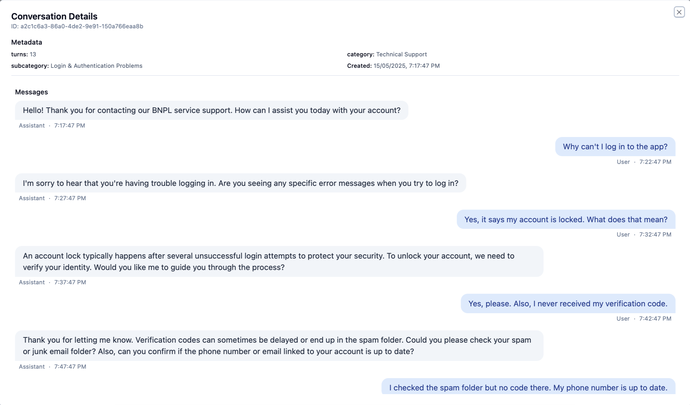

# Visualizing Results

Kura provides multiple ways to visualize your clustering results, from simple terminal output to an interactive web interface. This guide explains the visualization options and how to interpret them.

## Terminal Visualization

The simplest way to visualize Kura's clustering results is through the terminal:

```python
from kura import Kura
from kura.types import Conversation
import asyncio

# Initialize and run clustering
kura = Kura()
conversations = Conversation.from_hf_dataset("ivanleomk/synthetic-gemini-conversations")
asyncio.run(kura.cluster_conversations(conversations))

# Visualize in terminal
kura.visualise_clusters()
```

This will print a hierarchical tree of clusters with their names:

```
╠══ Compare and improve Flutter and React state management (45 conversations)
║   ╚══ Improve and compare Flutter and React state management (32 conversations)
║       ╠══ Improve React TypeScript application (15 conversations)
║       ╚══ Compare and select Flutter state management solutions (17 conversations)
╠══ Optimize blog posts for SEO and improved user engagement (28 conversations)
...
```

### Interpreting the Terminal Tree

- Each line represents a cluster or sub-cluster
- Tree symbols (╠══, ╚══) indicate the hierarchy
- Numbers in parentheses indicate how many conversations the cluster contains
- The cluster names are generated by Kura's language model

## Web Interface

Kura provides a comprehensive web interface for exploring results:

```bash
# Start the web server
kura

# Or with a custom checkpoint directory ( this is where we'll load the data from )
kura --dir ./my_checkpoints
```

Access the web interface at http://localhost:8000.

### Interface Components

The web interface includes several key components:

#### 1. Cluster Map

The cluster map is a 2D visualization of your clusters:

- Each dot represents a cluster
- Larger dots indicate clusters with more conversations
- Closeness in the map indicates semantic similarity
- Colors are assigned to distinct clusters


#### 2. Cluster Tree

The cluster tree shows the hierarchical relationship between clusters:

- Root-level clusters appear at the top
- Sub-clusters are nested below their parents
- Clicking on a cluster selects it for more details


#### 3. Cluster Details

When a cluster is selected, the details panel shows:

- Cluster name and description
- Number of conversations in the cluster
- Distribution of metadata values
- List of similar clusters


#### 4. Conversation Browser

View actual conversations within a selected cluster:

- Full message history for each conversation
- Conversation metadata
- Navigation between conversations in the cluster



## Customizing Visualizations

### Dimensionality Reduction

The 2D mapping is created through dimensionality reduction. You can customize this process:

```python
from kura.dimensionality import HDBUMAP
from kura import Kura

# Configure dimensionality reduction
dimensionality_model = HDBUMAP(
    n_neighbours=15,  # Controls local vs. global structure
    metric="cosine",  # Determines how we determine how close two points are
    min_dist=0.1,  # Controls spread of points
    n_components=2,  # Dimensions to reduce to (2 for visualization)
)

kura = Kura(dimensionality_reduction=dimensionality_model)
```

### Terminal Output Format

The terminal visualization is created in the `visualise_clusters` method of the `Kura` class. You can modify this method to change the output format if needed.

## Interpreting Results

When analyzing the visualizations, consider:

### Cluster Proximity

- Clusters that appear close together in the 2D map are semantically similar
- Distinct groupings suggest different conversation topics or themes
- Outliers may represent unique or unusual conversations

### Hierarchical Structure

- Parent clusters represent broader themes
- Child clusters represent more specific subtopics
- The depth of the hierarchy indicates thematic complexity

### Conversation Distribution

- Clusters with many conversations indicate common themes
- Clusters with few conversations may represent edge cases or emerging topics
- Even distribution suggests diverse user interactions

### Metadata Patterns

- Look for patterns in how metadata is distributed across clusters
- Clusters with high concentration of specific metadata values may indicate relationships between conversation topics and metadata attributes

## Exporting Visualization Data

While Kura doesn't have built-in export functionality for visualizations, you can access the raw data:

```python
# Load projected clusters
import json
from pathlib import Path

checkpoint_dir = Path("./checkpoints")
with open(checkpoint_dir / "dimensionality.jsonl") as f:
    projected_clusters = [json.loads(line) for line in f]

# Export to CSV for external visualization
import csv
with open("cluster_coordinates.csv", "w", newline="") as f:
    writer = csv.writer(f)
    writer.writerow(["id", "name", "x", "y", "count"])
    for cluster in projected_clusters:
        writer.writerow([
            cluster["id"],
            cluster["name"],
            cluster["x"],
            cluster["y"],
            cluster["count"]
        ])
```

## Next Steps

Now that you understand how to visualize and interpret Kura's results, you might want to:

- [Customize the clustering models](custom-models.md) to improve your results
- [Work with metadata](metadata.md) to add more dimensions to your analysis
- [Try advanced tutorials](../tutorials/advanced-usage.md) for more complex use cases
