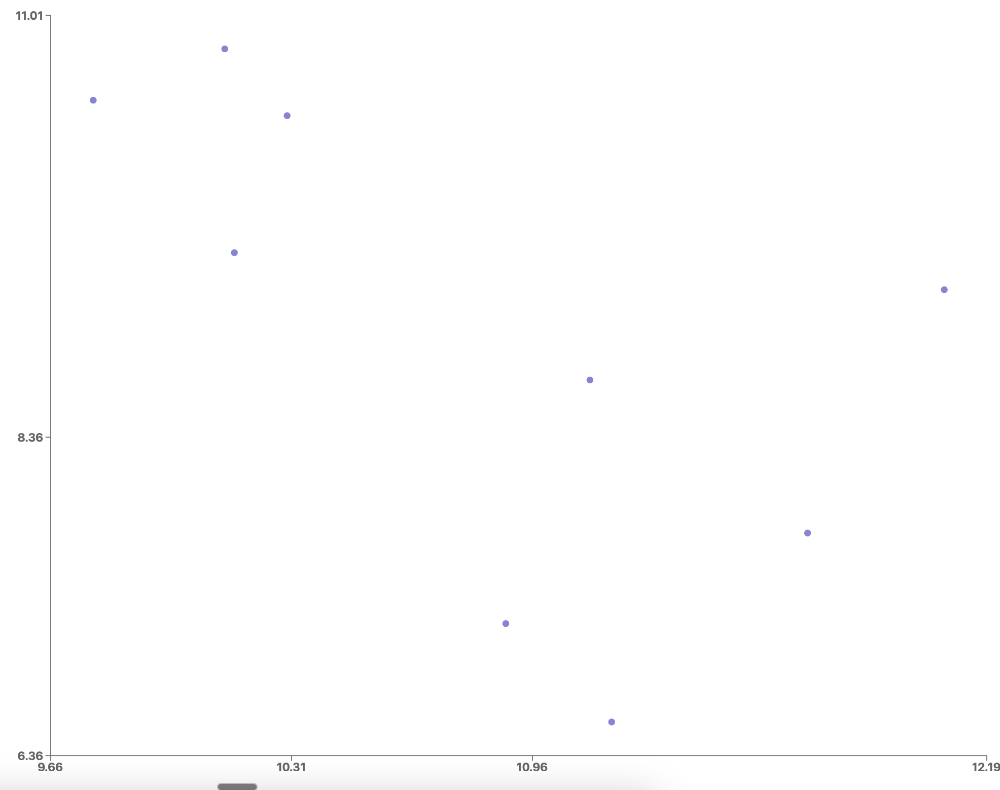
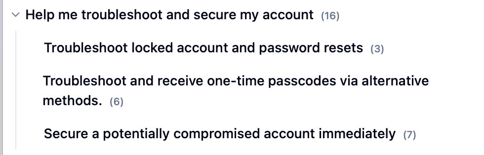
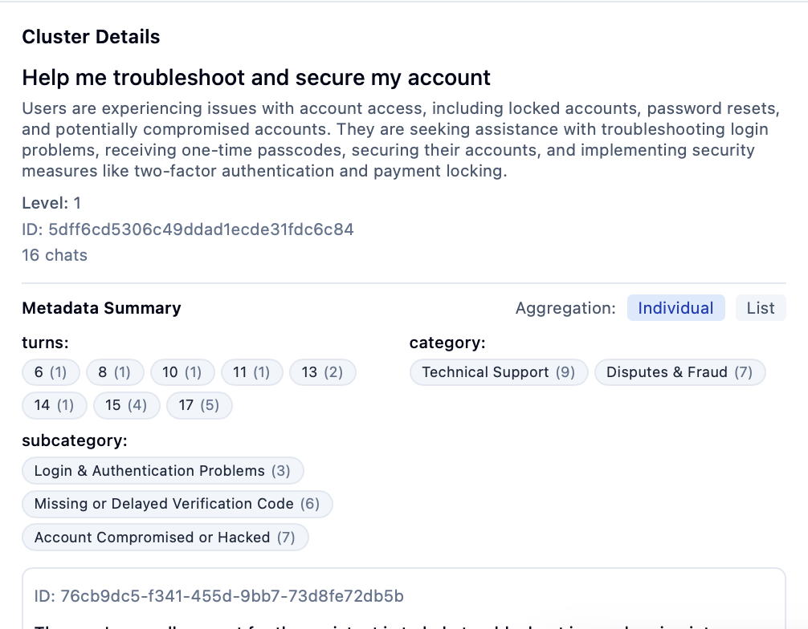

# Kura Documentation


## What is Kura?

Kura is an open-source tool for understanding and visualizing chat data, inspired by [Anthropic's CLIO](https://www.anthropic.com/research/clio). It helps you discover patterns, trends, and insights from user conversations by applying machine learning techniques to cluster similar interactions.

> Kura is kindly sponsored by [Improving RAG](http://improvingrag.com). If you're wondering what goes on behind the scenes of any production RAG application, ImprovingRAG gives you a clear roadmap as to how to achieve it.

## Why Analyze Conversation Data?

As AI assistants and chatbots become increasingly central to product experiences, understanding how users interact with these systems at scale becomes a critical challenge. Manually reviewing thousands of conversations is impractical, yet crucial patterns and user needs often remain hidden in this data.

Kura addresses this challenge by:

- **Revealing user intent patterns** that may not be obvious from individual conversations
- **Identifying common user needs** to prioritize feature development
- **Discovering edge cases and failures** that require attention
- **Tracking usage trends** over time as your product evolves
- **Informing prompt engineering** by highlighting successful and problematic interactions

By clustering similar conversations and providing intuitive visualizations, Kura transforms raw chat data into actionable insights without compromising user privacy.

## Real-World Use Cases

- **Product Teams**: Understand how users engage with your AI assistant to identify opportunities for improvement
- **AI Research**: Analyze how different models respond to similar queries and detect systematic biases
- **Customer Support**: Identify common support themes and optimize response strategies
- **Content Creation**: Discover topics users are interested in to guide content development
- **Education**: Analyze student interactions with educational AI to improve learning experiences
- **UX Research**: Gain insights into user mental models and friction points

## Features

- **Conversation Summarization**: Automatically generate concise task descriptions from conversations
- **Hierarchical Clustering**: Group similar conversations at multiple levels of granularity
- **Interactive Visualization**: Explore clusters through map, tree, and detail views
- **Metadata Extraction**: Extract valuable context from conversations using LLMs
- **Custom Models**: Use your preferred embedding, summarization, and clustering methods
- **Web Interface**: Intuitive UI for exploring and analyzing conversation clusters
- **CLI Tools**: Command-line interface for scripting and automation
- **Checkpoint System**: Save and resume analysis sessions

## Quick Start

> Kura requires python 3.9 because of our dependency on UMAP.

```python
from kura import Kura
from kura.embedding import OpenAIEmbeddingModel
from kura.summarisation import SummaryModel
from kura.dimensionality import DimensionalityReduction
from asyncio import run

# Initialize Kura with default components
kura = Kura(
    embedding_model=OpenAIEmbeddingModel(),
    summarisation_model=SummaryModel(),
    dimensionality_reduction=DimensionalityReduction(),
    max_clusters=10,
    checkpoint_dir="./checkpoints",
)

# Load conversations and run the clustering pipeline
kura.load_conversations("conversations.json")
run(kura.cluster_conversations())

# Visualize the results in the terminal
kura.visualise_clusters()

# Or start the web interface
# In your terminal: kura start-app
```

To explore more features, check out:
- [Installation Guide](getting-started/installation.md)
- [Quickstart Guide](getting-started/quickstart.md)
- [Core Concepts](core-concepts/overview.md)

## Architecture

Kura follows a modular, pipeline-based architecture:

1. **Data Loading**: Import conversations from various sources
2. **Summarization**: Generate concise descriptions of each conversation
3. **Embedding**: Convert text into vector representations
4. **Base Clustering**: Group similar summaries into initial clusters
5. **Meta-Clustering**: Create a hierarchical structure of clusters
6. **Dimensionality Reduction**: Project high-dimensional data for visualization
7. **Visualization**: Display clusters through web UI or CLI

### Core Components

- **`Kura`**: Main orchestrator for the entire pipeline
- **`OpenAIEmbeddingModel`**: Converts text to vector embeddings
- **`SummaryModel`**: Generates concise conversation summaries
- **`ClusterModel`**: Creates initial clusters from embeddings
- **`MetaClusterModel`**: Builds hierarchical structure from base clusters
- **`DimensionalityReduction`**: Projects data to 2D for visualization
- **`Conversation`**: Core data model for chat interactions

## Web Interface

Kura includes a React/TypeScript web interface with:

- **Cluster Map**: 2D visualization of conversation clusters
- **Cluster Tree**: Hierarchical view of cluster relationships
- **Cluster Details**: In-depth information about selected clusters
- **Conversation Dialog**: Examine individual conversations
- **Metadata Filtering**: Filter clusters based on extracted properties

Start the web interface with:

```bash
kura start-app
# Access at http://localhost:8000
```

### UI Examples

The web interface provides intuitive visualizations of your conversation data:

<table>
  <tr>
    <td><br/><em>Cluster Map: 2D visualization of conversation clusters</em></td>
    <td><br/><em>Cluster Tree: Hierarchical view of cluster relationships</em></td>
  </tr>
  <tr>
    <td colspan="2"><br/><em>Cluster Details: In-depth information about selected clusters</em></td>
  </tr>
</table>

## Checkpoints

Kura saves state between runs using checkpoint files:

- `conversations.json`: Raw conversation data
- `summaries.jsonl`: Summarized conversations
- `clusters.jsonl`: Base cluster data
- `meta_clusters.jsonl`: Hierarchical cluster data
- `dimensionality.jsonl`: Projected cluster data

Checkpoints are stored in the directory specified by `checkpoint_dir` (default: `./checkpoints`).

## Comparison with Similar Tools

| Feature | Kura | Traditional Analytics | Manual Review | Generic Clustering |
|---------|------|----------------------|--------------|-------------------|
| Semantic Understanding | ✅ Uses LLMs for deep understanding | ❌ Limited to keywords | ✅ Human understanding | ⚠️ Basic similarity only |
| Scalability | ✅ Handles thousands of conversations | ✅ Highly scalable | ❌ Time intensive | ✅ Works at scale |
| Visualization | ✅ Interactive UI | ⚠️ Basic charts | ❌ Manual effort | ⚠️ Generic plots |
| Hierarchy Discovery | ✅ Meta-clustering feature | ❌ Flat categories | ⚠️ Subjective grouping | ❌ Typically flat |
| Extensibility | ✅ Custom models and extractors | ⚠️ Limited customization | ✅ Flexible but manual | ⚠️ Some algorithms |
| Privacy | ✅ Self-hosted option | ⚠️ Often requires data sharing | ✅ Can be private | ✅ Can be private |

## Future Roadmap

Kura is actively evolving with plans to add:

- **Enhanced Topic Modeling**: More sophisticated detection of themes across conversations
- **Temporal Analysis**: Tracking how conversation patterns evolve over time
- **Advanced Visualizations**: Additional visual representations of conversation data
- **Data Connectors**: More integrations with popular conversation data sources
- **Multi-modal Support**: Analysis of conversations that include images and other media
- **Export Capabilities**: Enhanced formats for sharing and presenting findings

## Technical Walkthrough

I've also recorded a technical deep dive into what Kura is and the ideas behind it if you'd rather watch than read.

<iframe width="560" height="315" src="https://www.youtube.com/embed/TPOP_jDiSVE?si=uvTond4LUwJGOn4F" title="YouTube video player" frameborder="0" allow="accelerometer; autoplay; clipboard-write; encrypted-media; gyroscope; picture-in-picture; web-share" referrerpolicy="strict-origin-when-cross-origin" allowfullscreen></iframe>

For a written walkthrough of the code, check out this [blog post](https://ivanleo.com/blog/understanding-user-conversations).